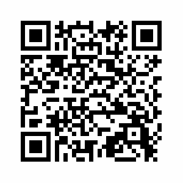

#HSLIDE
## Robinson Forest
### Camp mapping exercise

#HSLIDE
## In past years
### we GPS mapped trails to fire tower and points of interest

#HSLIDE?image=images/robinson_forest/Detailed_TrailMap_RobinsonForest.jpg

#HSLIDE?image=https://geography.as.uky.edu/sites/default/files/RobinsonForestCamp_TrailMap.jpg
<h2 style="color:#f00;text-shadow: 2px 2px 4px #fff;"><a href="https://geography.as.uky.edu/sites/default/files/RobinsonForestCamp_TrailMap.jpg" target="blank">3D layout</a></h2>

#HSLIDE
## This year
### Let's make a dendrology tour!

#HSLIDE
## Our day
* Morning: GPS features in the field using Avenza Maps app and the GeoPDF in this presentation.
* Bring a mobile device with the app and map installed!
* Afternoon: use QGIS to edit GPS data and make a new map.
* If you have a laptop at camp, please install QGIS.

#HSLIDE
## Apps needed

#HSLIDE
## Install this free app:
### <a href="http://www.avenza.com/pdf-maps" target="blank">Avenza Maps</a>

#HSLIDE
## Get a Dropbox account:
### <a href="https://www.dropbox.com/home" target="blank">Dropbox</a>

#HSLIDE
## Then add this map in Avenza Maps:
Sync this <a href="https://outragegis.com/download/r/Detailed_TrailMap_RobinsonForest.pdf" target="blank">GeoPDF</a> in Dropbox and download to app     
     
or use QR code to download map to app!

#HSLIDE
## QGIS
* QGIS is free and open source desktop GIS.
* Install if you want to use your laptop at field camp.
* The application runs on Windows, Mac OS, and Linux.
* It has awesome tools to make sweet maps.
* <a href="http://download.qgis.org" target="blank">download.qgis.org</a>

#HSLIDE
## See you soon!

#HSLIDE?image=https://farm5.staticflickr.com/4190/34444679751_44f3866f33_o.jpg
