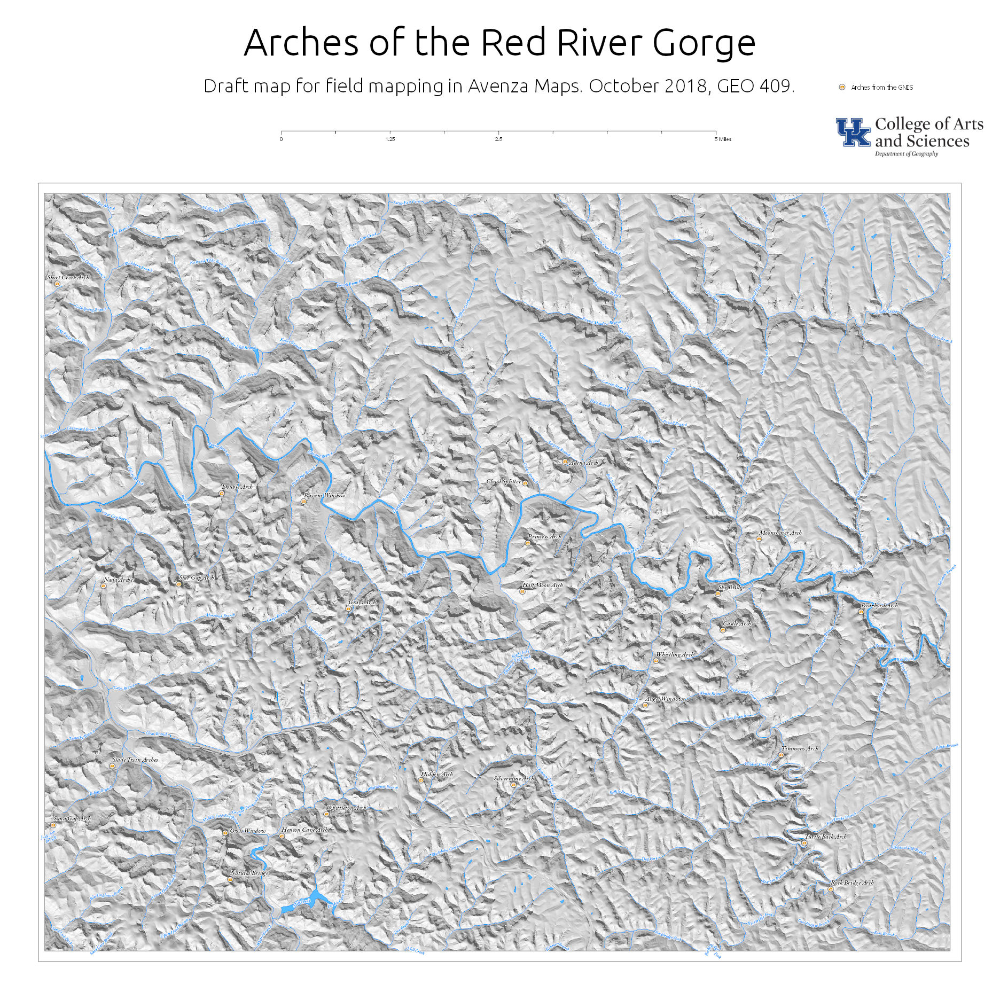

#HSLIDE
# GEO 409
## Module 05: Field mapping

#HSLIDE
## 2018
# Fall
#### Field trips!

#HSLIDE
## October 13, 27
## December 1
### Details on Canvas Discussion board

#HSLIDE
## Due
### December 6

#HSLIDE?image=https://farm2.staticflickr.com/1901/44221426354_d8a711a753_h.jpg

#HSLIDE?image=https://farm2.staticflickr.com/1922/43128933340_d6d61a6bb2_h.jpg

#HSLIDE
## Load app
# Avenza Maps 
#### on your mobile device.
[avenzamaps.com](https://avenzamaps.com)

#HSLIDE
## Load campus map with QR code

#HSLIDE?image=images/get-map.png

#HSLIDE
## Finish base map for RRG
* Layers should include arches
* streams, waterbodies, rivers
* labeled streams and arches
* a hillshade background
* Export as GeoPDF

#HSLIDE?image=https://farm1.staticflickr.com/930/42790171395_a745af0f06_h.jpg

#HSLIDE
## Load RRG base map
* Use your RRG repository
* Upload PDF and find URL
* https://username.github.io/rrg/basemap/rrg.pdf

#HSLIDE
## Example map

#HSLIDE?image=images/rrg.jpg

#HSLIDE?image=https://farm2.staticflickr.com/1959/43128931410_daceab6096_h.jpg
