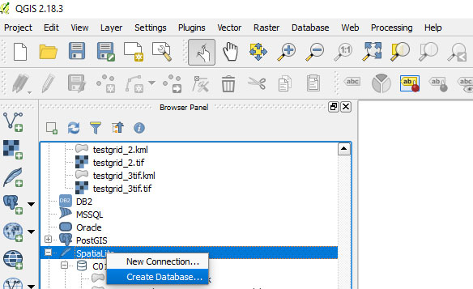

#HSLIDE
# GEO 409:01
## Advanced topics in GIS

#HSLIDE
## Topics
* Tools for the knowledge worker
* Challenge: create a script to measure area

#HSLIDE
## Your task:
# Lesson 01
on Canvas


#HSLIDE
### Tools for the
## Knowledge Worker

#HSLIDE
## We need to
# manage text

#HSLIDE
### Particularly code, a/k/a
## plain text instructions.


#HSLIDE
A good code editor offers
## Language syntax highlighting
auto-complete, find and replace, and code folding.

#HSLIDE
We'll use
## <a href="https://www.anaconda.com/download" target="blank">VS Code</a>
(as part of Python 3.6) and <a href="https://www.sublimetext.com" target="blank">Sublime</a>.

#HSLIDE
## Customize VS Code
1. Increase font sizes
2. Create working directory, our root
3. Bling it up with themes!

#HSLIDE
## Increase font sizes
Open *File > Preferences > Settings*

#HSLIDE?image=images/02/q001.png
<h2 style="color:#eee;text-shadow: 2px 2px 4px #000;">Access USER SETTINGS</h2>

#HSLIDE
## Copy and paste:
```json
"terminal.integrated.shell.windows": "C:\\WINDOWS\\System32\\cmd.exe",
"editor.fontSize": 17
"editor.lineHeight":25,
"terminal.integrated.fontSize": 18,
"terminal.integrated.lineHeight": 1.05
```

#HSLIDE
### Let's setup your local root
## GIS project directory
where all of your GIS projects, assets, files, repos, and everything else will be stored related to class.

#HSLIDE
## Create working directory
Open *View > Terminal*

#HSLIDE?image=images/02/q002.png
<h2 style="color:#eee;text-shadow: 2px 2px 4px #000;">Access console, terminal, command line, shell, etc.</h2>

#HSLIDE
## Type in the terminal I
```bat
:: This is a comment in windows terminal
:: Change directory to top of C: drive
cd C:\
:: If you're not on C: drive execute
C:
```
#HSLIDE
## Type in the terminal II
```bat
:: make a directory on C:
mkdir GIS
:: go into the new directory
cd GIS
```
#HSLIDE
## Type in the terminal II
```bat
:: make a directory on C:/GIS
:: Change to your COOL COOL name
mkdir BoydsGIS 
:: go into the new directory
cd BoydsGIS 
```
#HSLIDE
# How will I
## possible know all these commands?!?

#HSLIDE?image=images/02/q003.png
<h2 style="color:#eee;text-shadow: 2px 2px 4px #000;">Commands</h2>
<a href="http://simplyadvanced.net/blog/cheat-sheet-for-windows-command-prompt/" target="blank">cheat sheet</a>

#HSLIDE
#### OR, go to:
### _C:/users_
and create a folder called,   
### _MyFunNameGIS_    
replacing "MyFunName" with your fun name.

#HSLIDE
# Add readme.md
## in new directory
A Readme.md is a Markdown formatted file that tells visitors about your project (and helps you remember, too!)

#HSLIDE?image=images/02/q004.png
<h2 style="color:#eee;text-shadow: 2px 2px 4px #000;">Open Folder...</h2>

#HSLIDE?image=images/02/q005.png
<h2 style="color:#eee;text-shadow: 2px 2px 4px #000;">Right-click...</h2>

#HSLIDE?image=images/02/q006.png
<h2 style="color:#eee;text-shadow: 2px 2px 4px #000;">Make and preview</h2>

#HSLIDE?image=images/02/markdown.md.jpg
<h2 style="color:#eee;text-shadow: 2px 2px 4px #000;">Many ways to create</h2>
<a href="https://github.com/adam-p/markdown-here/wiki/Markdown-Cheatsheet" target="blank">Markdown.md</a>

#HSLIDE
Manage projects to
## Prevent loss of text
and support collaboration

#HSLIDE
# GIT
"Git is a version control system for tracking changes in computer files and coordinating work on those files among multiple people."

#HSLIDE
      
[xctd](http://xkcd.com/)


#HSLIDE  
[Git](https://git-scm.com/) was created by Linus Torvalds in 2005 for development of the Linux kernel, with other kernel developers contributing to its initial development.


#HSLIDE
We'll use the git hosting service
### GitHub
and their desktop app to manage our projects.

#HSLIDE
Get account at [GitHub.com](https://github.com/) using your
### uky.edu
email address

#HSLIDE
### Our GitHub flow each week
* Find invitation to lesson in Canvas
* Accept invitation and _clone remote repository_
* Work through lesson/lab and save work
* _Commit_ changes as you go and _push_ when finished.

#HSLIDE
### GitHub Pages
Use GitHub to publish web pages, including
### Map Portfolio!


#HSLIDE
### Let's clone our lesson
## Repo
(use link in Canvas)

#HSLIDE
## Challenge!

#HSLIDE
## Create a local repo:
## _geo409_
inside your root GIS folder

#HSLIDE?image=images/02/create_local_repo.png

#HSLIDE
# Publish
## in GitHub

#HSLIDE
## Create a remote repo called
## _rrg_
(if you haven't already)

#HSLIDE?image=images/02/create_remote_repo.png

#HSLIDE
# Clone
## to local root GIS folder

#HSLIDE?image=images/02/natural-earth-download.jpg
<div style="background-color: rgba(0,0,0,0.4);width:100%;height:100%;margin: 0 auto;padding:20px 0;">
<h2 style="color:#eee;text-shadow: 2px 2px 4px #000;">Download data</h2>
<h3 style="color:#eee;text-shadow: 2px 2px 4px #000;">to "downloaded-data" folder</h3>
<a href="http://www.naturalearthdata.com/downloads/10m-cultural-vectors/" target="blank">Natural Earth</a>
</div>

#HSLIDE?image=images/02/natural-earth-download.jpg


#HSLIDE
## Create folder in _geo409_
### "c01"
* Open ArcMap
* and QGIS


#HSLIDE
## Measure state areas in
# ArcMap

#HSLIDE
## Change your Data Frame's
# Projection

#HSLIDE?image=images/02/arcmap-projection.jpg
<h2 style="color:#111;text-shadow: 2px 2px 4px #eee;">EPSG: 5070</h2>

#HSLIDE
```
NAD_1983_Contiguous_USA_Albers
WKID: 5070 Authority: EPSG

Projection: Albers
False_Easting: 0.0
False_Northing: 0.0
Central_Meridian: -96.0
Standard_Parallel_1: 29.5
Standard_Parallel_2: 45.5
Latitude_Of_Origin: 23.0
Linear Unit: Meter (1.0)

Geographic Coordinate System: GCS_North_American_1983
Angular Unit: Degree (0.0174532925199433)
Prime Meridian: Greenwich (0.0)
Datum: D_North_American_1983
  Spheroid: GRS_1980
    Semimajor Axis: 6378137.0
    Semiminor Axis: 6356752.314140356
    Inverse Flattening: 298.257222101

```


#HSLIDE
```
North_America_Albers_Equal_Area_Conic
WKID: 102008 Authority: Esri

Projection: Albers
False_Easting: 0.0
False_Northing: 0.0
Central_Meridian: -96.0
Standard_Parallel_1: 20.0   // Only change in
Standard_Parallel_2: 60.0   // standard parallels
Latitude_Of_Origin: 40.0    // and refocus north
Linear Unit: Meter (1.0)

Geographic Coordinate System: GCS_North_American_1983
Angular Unit: Degree (0.0174532925199433)
Prime Meridian: Greenwich (0.0)
Datum: D_North_American_1983
  Spheroid: GRS_1980
    Semimajor Axis: 6378137.0
    Semiminor Axis: 6356752.314140356
    Inverse Flattening: 298.257222101

```


#HSLIDE
### Select only those states we need
## Definition Query
```
"name" in ('Texas','Alaska','Kentucky')
```

#HSLIDE?image=images/02/arcmap-definition-query.jpg
<h2 style="color:#111;text-shadow: 2px 2px 4px #eee;"></h2>


#HSLIDE
## Open attribute table
# Add Field
as **Type: Float**

#HSLIDE?image=images/02/arcmap-add-field.jpg
<h2 style="color:#111;text-shadow: 2px 2px 4px #eee;"></h2>

#HSLIDE
## Right+click
# Field
and **Calculate Geometry**

#HSLIDE?image=images/02/arcmap-area.jpg
<h2 style="color:#111;text-shadow: 2px 2px 4px #eee;"></h2>


#HSLIDE
## ArcMap mesaurement

```
name,       area_sq_km
Alaska,     1496210
Texas,      685531
Kentucky,   104525
```

#HSLIDE
## Measure state areas in
# QGIS

#HSLIDE
### Housekeeping
open pgAdmin and check if PostGIS is installed

#HSLIDE?image=images/02/postgres.png


<!-- #HSLIDE
## Create new SpatiaLite database
    
Then open **QGIS menu > Database > DB Manager** -->


#HSLIDE
### QGIS Browser Panel
## Connect PostGIS database


#HSLIDE?image=images/02/connect_postgres.png

#HSLIDE
### QGIS DB Manager
## Import Layer


#HSLIDE?image=images/02/qgis-import-layer.png

#HSLIDE
### Finally!
## Open SQL Window

#HSLIDE?image=images/02/qgis-connect-db.png

#HSLIDE?image=images/02/qgis-execute-sql.jpg
<h2 style="color:#111;text-shadow: 2px 2px 4px #eee;">Execute SQL...</h2>


#HSLIDE

```
/* select everything */

select * from ne_10m_admin_1_states_provinces_lakes
```

#HSLIDE

```
/* select just texas, kentucky, and alaska */

select
    name
from
    ne_10m_admin_1_states_provinces_lakes
where
    name in ('Texas','Alaska','Kentucky')
```

#HSLIDE

```
/* select states and calculate area */

select
    name,
    ST_Area(geom) As "area in what units?"
from
    ne_10m_admin_1_states_provinces_lakes
where
    name in ('Texas','Alaska','Kentucky')
```

#HSLIDE

```
/* select states and calculate area in new projection, EPSG: 5070 */

select
    name,
    ST_Area(ST_Transform(geom, 5070)) As "sq. meters"
from
    ne_10m_admin_1_states_provinces_lakes
where
    name in ('Texas','Alaska','Kentucky')
```


#HSLIDE

```
/* select states and calculate area in new projection, EPSG: 5070 */

select
    name,
    ST_Area(ST_Transform(geom, 5070)/1000000) As "sq km"
from
    ne_10m_admin_1_states_provinces_lakes
where
    name in ('Texas','Alaska','Kentucky')
```

#HSLIDE

```
/* select states and calculate area in new projection, EPSG: 5070 */
/* and sort, too! */

select
    name,
    ST_Area(ST_Transform(geom, 5070))/1000000 As "sq km"
from
    ne_10m_admin_1_states_provinces_lakes
where
    name in ('Texas','Alaska','Kentucky')
order
	by "sq km" DESC

```


#HSLIDE

## Measurement

```
name,       sq km
Alaska,     1505637.34
Texas,      684969.01
Kentucky,   104576.98

```


#HSLIDE

## FYI area on Spheroid via PostGIS

```
name,       sq km
Alaska,     1505638.85
Texas,      684969.02
Kentucky,   104576.98

```

#HSLIDE
```bash
ogr2ogr -f CSV output.csv -dialect PG -sql "select * from ne_10m_admin_1_states_provinces_lakes" ne_10m_admin_1_states_provinces_lakes.shp

ogr2ogr -f CSV output.csv -sql \
"select name, (OGR_GEOM_AREA/1000000) as sq_km from ne_10m_admin_1_states_provinces_lakes" projected.geojson

ogr2ogr -f CSV output.csv -sql "select name, (st_area(geom,true)/1000000) as sq_km from ne_10m_admin_1_states_provinces_lakes where name in ('Texas','Alaska','Kentucky')" PG:"dbname=boyd host=localhost port=54327"

ogr2ogr -f CSV output.csv -sql "select name, (st_area(geom,true)/1000000) as sq_km from ne_10m_admin_1_states_provinces_lakes where name in ('Texas','Alaska','Kentucky')" PG:"dbname=boyd host=10.0.1.152 port=54327"

ogr2ogr -f geojson projected.geojson -sql "select name from ne_10m_admin_1_states_provinces_lakes where name in ('Texas','Alaska','Kentucky')" -s_srs EPSG:4326 -t_srs EPSG:5070 ne_10m_admin_1_states_provinces_lakes.shp

```

#HSLIDE
### Save your
## SQL & project files
#### then commit and push!

#HSLIDE
## That's the
# Challenge
this semester and we'll keep at it!

#HSLIDE
Structured Query Language
## SQL
pronounced "sequel", also just "SQL", & perhaps most used language to manage data.

#HSLIDE
## GIS is
# Big Data

#HSLIDE
Hypertext Markup Language
## HTML
The code that tells your browser how to display a web page.

#HSLIDE
(Carto) Cascading Style Sheets
## CSS and CartoCSS
Used with HTML to render pretty web pages.

#HSLIDE
Start tinkering with examples
## <a href="http://www.w3schools.com" target="blank">w3schools.com</a>
