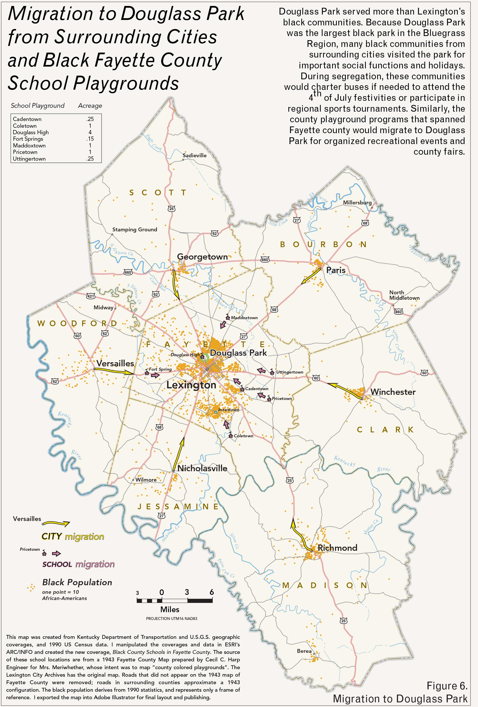
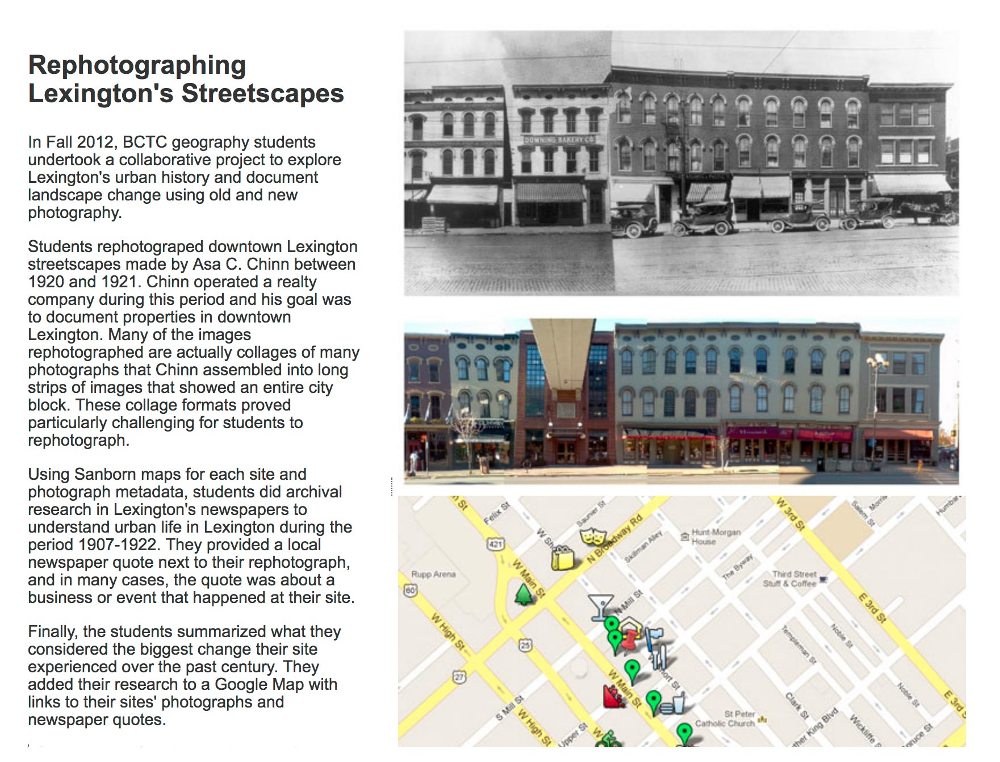
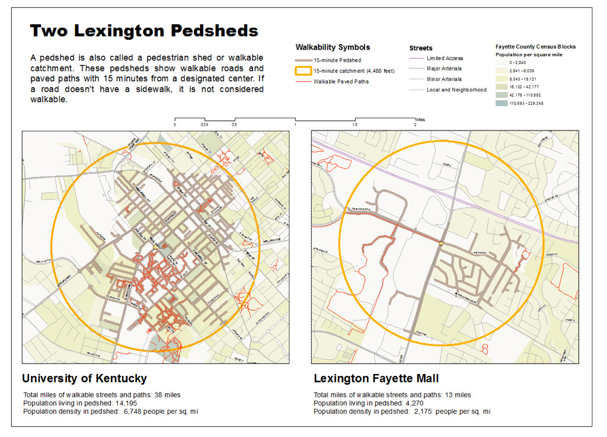

#HSLIDE
## GIS Class Projects
### Boyd Shearer
<h4 style="color:Moccasin;">gitpitch.com/boydx/geosalad/uky</h4>

#HSLIDE
### Instructor
* UKy Geography (GEO 130, 160, 309, 409)
* Natural Resources & Environmental Sciences (NRE 355, FOR 330)
* New Maps Plus (MAP 671, 672)

<!-- #HSLIDE?image=http://newmaps.uky.edu/sites/default/files/findinggeocaches.jpg -->
#HSLIDE?image=https://farm8.staticflickr.com/7314/27035801094_2fc8230652_h.jpg

<h2 style="color:#eee;text-shadow: 2px 2px 4px #000;">Map Camp!</h2>
<a href="https://plus.google.com/118185113381405635119" target="blank">LINK</a>

#HSLIDE
### Unifying theme
## Field work

#HSLIDE?image=images/01/map-cuga.jpg
<h2 style="color:#eee;text-shadow: 2px 2px 4px #000;">I make maps</h2>
<a href="https://outrageGIS.com" target="blank">outrageGIS.com</a>

#HSLIDE
#### Latest project: mapping <a href="https://www.outragegis.com/gap" target="blank">Cumberland Gap</a>
<iframe src="https://www.outragegis.com/gap/3d/" width="100%" height="600px"></iframe>

#HSLIDE
### History at
## UKy Geography

#HSLIDE
### 1998
## The Daily Aesthetic
### M.A. Thesis on Douglass Park
(park established in 1916)

#HSLIDE

#HSLIDE
### Lucy Rowe Estill

#HSLIDE
### James O. Jones
 
(second from right)

#HSLIDE?image=i/12.jpg

#HSLIDE?image=i/06.jpg

#HSLIDE?image=i/11.jpg

<h3 style="color:#eee;text-shadow: 2px 2px 4px #000;">2001</h3>
<h2 style="color:#eee;text-shadow: 2px 2px 4px #000;">At Leisure's Edge</h2>
<h4 style="color:#eee;text-shadow: 2px 2px 4px #000;">One-hour documentary for Kentucky Educational Television</h4>
<!-- <a href="https://www.ket.org/series/KLEIS/" target="blank">LINK</a> -->

#HSLIDE
<iframe src="https://www.boydshearer.com/media/AtLeisuresEdge" width="100%" height="600px"></iframe>

#HSLIDE?image=i/05.jpg

<h2 style="color:#eee;text-shadow: 2px 2px 4px #000;">uky.edu/Projects/TDA</h2>
<a href="https://www.uky.edu/Projects/TDA/" target="blank">LINK</a>

#HSLIDE
### Graduated.
## Now what?
#### Keep mapping (and field checking)!

<!-- #HSLIDE?image=https://www.uky.edu/Projects/TDA/video/maps/chero-parks-s.jpg -->
#HSLIDE?image=i/13.jpg

<h3 style="color:#eee;text-shadow: 2px 2px 4px #000;">1999</h3>
<h2 style="color:#eee;text-shadow: 2px 2px 4px #000;">Kentucky VideoGIS</h2>
<h4 style="color:#eee;text-shadow: 2px 2px 4px #000;">Maps for TV news production</h4>

#HSLIDE
### Mapping/geo gigs
## can have nice paychecks
#### so, it does pay to be a geographer.

#HSLIDE?image=i/14.jpg

<h3 style="color:#eee;text-shadow: 2px 2px 4px #000;">2003</h3>
<h2 style="color:#eee;text-shadow: 2px 2px 4px #000;">First Frontier</h2>
<h4 style="color:#eee;text-shadow: 2px 2px 4px #000;">audio driving tour</h4>
<h4 style="color:#ccc;text-shadow: 2px 2px 4px #000;">(Into the mountains!)</h4>

#HSLIDE?image=i/08.jpg

#HSLIDE
### 2006 redesign department's web site

(I'm back!)

#HSLIDE
### Teaching provides more opportunities for
# field work
#### (2006)

#HSLIDE
# GEO 130

#HSLIDE?image=i/09.jpg

#HSLIDE
#### Acid test for carbonate rocks (and polyester pants)

#HSLIDE
# GEO 172

#HSLIDE?image=http://district.bluegrass.kctcs.edu/bshearer0002/geo172/RephotoLex/08/08.jpg

<h2 style="color:#eee;text-shadow: 2px 2px 4px #000;">Rephotographing Lexington's streetscapes</h2>
<a href="http://district.bluegrass.kctcs.edu/bshearer0002/geo172/RephotoLex/" target="blank">LINK</a>

#HSLIDE

#HSLIDE?image=i/04.jpg

#HSLIDE?image=i/03.jpg

#HSLIDE?image=i/02.jpg

#HSLIDE
# NRE 355

#HSLIDE
## Pilot Knob SNP
### Trails
<a href="http://sweb.uky.edu/~blshea1/nre355/pksnp/" target="blank">and a website</a>

#HSLIDE?image=https://c1.staticflickr.com/6/5697/31017969892_6a6f41ec25_o.jpg

#HSLIDE?image=https://farm6.staticflickr.com/5620/31047412341_bf8ece65f4_h.jpg

#HSLIDE?image=https://farm6.staticflickr.com/5730/30340396284_a169bdc431_o.jpg

#HSLIDE?image=https://farm6.staticflickr.com/5730/30340396284_a169bdc431_o.jpg
<iframe src="https://townbranch.carto.com/builder/dbce1cd2-b019-11e6-bd55-0e05a8b3e3d7/embed" width="100%" height="520" frameborder="0" allowfullscreen="allowfullscreen"></iframe>

#HSLIDE
## Pine Mountain SRP
### Scenic Analysis
<a href="http://sweb.uky.edu/~blshea1/nre355/pine-mountain-canopy-tour/" target="blank">LINK</a>

#HSLIDE?image=https://farm6.staticflickr.com/5678/23200804570_7ba220d2d1_h.jpg

<!-- #HSLIDE?image=https://geography.as.uky.edu/sites/default/files/PineMountainCanopyTour.jpg -->
#HSLIDE?image=https://farm1.staticflickr.com/576/23495298805_ce5ec0030d_h.jpg

#HSLIDE?image=https://farm1.staticflickr.com/681/22868246864_2fb8e40e79_h.jpg

#HSLIDE?image=https://farm1.staticflickr.com/691/23469905426_2baff7bd7c_h.jpg

#HSLIDE
## Arboretum Woods
### Tree Census
<a href="https://geography.as.uky.edu/sites/default/files/BoydShearer_Lab3_ArboretumWoodsTreeCensus.jpg" target="blank">LINK</a>

#HSLIDE?image=https://geography.as.uky.edu/sites/default/files/BoydShearer_Lab3_ArboretumWoodsTreeCensus_700.jpg

#HSLIDE
## Robinson Forest Camp
### trail map
<a href="https://geography.as.uky.edu/sites/default/files/RobinsonForestCamp_TrailMap.jpg" target="blank">map</a>

#HSLIDE?image=https://geography.as.uky.edu/sites/default/files/RobinsonForestCamp_TrailMap.jpg

#HSLIDE?image=https://farm5.staticflickr.com/4175/34413343182_c906452c0b_h.jpg

#HSLIDE?image=https://farm5.staticflickr.com/4190/34444679751_f169c65f1a_h.jpg

#HSLIDE
# GEO 309

#HSLIDE
## Student observations
### NCAA tournament basketball celebrations
<a href="https://geography.as.uky.edu/sites/default/files/CampusCelebrations_Layout_150508-01.jpg" target="blank">map</a>

#HSLIDE?image=i/10.jpg

#HSLIDE
## Fayette County
### Scenic Analysis
<a href="https://geography.as.uky.edu/sites/default/files/SceniicLandscapeIndexFayetteCounty_th.jpg" target="blank">map</a>

#HSLIDE?image=https://farm5.staticflickr.com/4263/35717804616_c71b17d150_h.jpg

#HSLIDE
# GEO 409

#HSLIDE
## Analyzing
### Walkability

#HSLIDE?image=images/01/map-create-zones.jpg
<h2 style="color:#111;text-shadow: 2px 2px 4px #fff;">Divide city into zones.</h2>

#HSLIDE?image=images/01/map-digitize-paths.jpg
<h2 style="color:#111;text-shadow: 2px 2px 4px #fff;">Digitize walking paths.</h2>

#HSLIDE
### Build a network model
connecting paths to streets with sidewalks.

#HSLIDE
   
Create a pedshed to measure how many people can access what parts of town on foot.

#HSLIDE?image=https://geography.as.uky.edu/sites/default/files/GEO409_2014_FinalProject_Preview.jpg
<h3 style="color:#eee;text-shadow: 2px 2px 4px #000;">Where are the "cow paths" on campus?</h3>
<h4 style="color:#eee;text-shadow: 2px 2px 4px #000;">Are they quicker than sidewalks?</h4>

#HSLIDE
## Let's make web maps!

#HSLIDE?image=http://boydx.github.io/collisions/images/VineStreet_LexingtonKentucky.jpg
<h3 style="color:#eee;text-shadow: 2px 2px 4px #000;">Bike/Pedestrian vs. Car Collision Analysis</h3>
<a href="http://boydx.github.io/collisions/" target="blank">Bring in CARTO!</a>

#HSLIDE
### Web pages need a host
* Student web server @ sweb.uky.edu (free but -----DECOMMISSIONED??-----)
* GitHub Pages (comes with version control and syncing)

#HSLIDE
# GEO 409
## Spring 2017

#HSLIDE
## Discovering
### Town Branch Trail
<a href="https://reece2ke.github.io/geo409_site/index.html" target="blank">LINK</a>

#HSLIDE

#### The team
<iframe width="100%" height="600px" src="https://kuula.co/share/7lLKn"></iframe>

#HSLIDE
## Used mostly open source tools
### QGIS and OpenStreetMap

#HSLIDE
### We found Lidar data
## Building heights!

#HSLIDE?image=https://farm3.staticflickr.com/2842/34173538111_fed5f045cf_h.jpg
<a href="https://farm3.staticflickr.com/2842/34173538111_a32119a81c_o.jpg" title="Block diagram of downtown Lexington, Kentucky" target="blank">LINK</a>

#HSLIDE
## Project link
<a href="https://reece2ke.github.io/geo409_site/index.html" target="blank">LINK</a>

#HSLIDE?image=images/01/trees.jpg
<h2 style="color:#eee;text-shadow: 2px 2px 4px #000;">And then tree heights!</h2>
<a href="http://boydx.github.io/tbt/oblique/" target="blank">map</a>

#HSLIDE
# NRE 355
## Fall 2017
<a href="https://rvirto01.github.io/NRE355_Tree_canopy_study/" taRGET="BLANK">LINK</a>

#HSLIDE?image=https://farm5.staticflickr.com/4538/24677325668_1700ac43f7_h.jpg
<a href="https://farm5.staticflickr.com/4538/24677325668_f74b390108_o.jpg" title="Estimated tree heights in Lexington&#x27;s North Limestone neighborhood" target="blank">LINK</a>

#HSLIDE
### Finding the highest trees
<iframe width="100%" height="500px" src="https://bluegrassland.carto.com/builder/50150569-e092-4c28-a67f-eb4bfbc7a50e/embed"></iframe>

#HSLIDE
## Project link
<a href="https://rvirto01.github.io/NRE355_Tree_canopy_study/" taRGET="BLANK">LINK</a>

#HSLIDE
## Now, go take a hike
<iframe src="https://outragegis.com/maps/bluegrass/" width="100%" height="600px"></frame>

#HSLIDE
## Postscript

#HSLIDE?image=https://c1.staticflickr.com/1/390/31713088315_f0326f577c_k.jpg
<h2 style="color:#eee;text-shadow: 2px 2px 4px #000;">I photograph</h2>

#HSLIDE?image=https://c1.staticflickr.com/6/5324/30627102241_3cde14d218_o.jpg
<h2 style="color:#eee;text-shadow: 2px 2px 4px #000;">I walk a lot</h2>

#HSLIDE?image=https://c1.staticflickr.com/6/5555/25390145339_41f3abb792_h.jpg
<h2 style="color:#eee;text-shadow: 2px 2px 4px #000;">I'm a recent new dad</h2>

#HSLIDE?image=https://c1.staticflickr.com/1/710/31150476630_13ead32b58_k.jpg  
<h3 style="color:#eee;text-shadow: 2px 2px 4px #000;">I like to experiment</h3>
