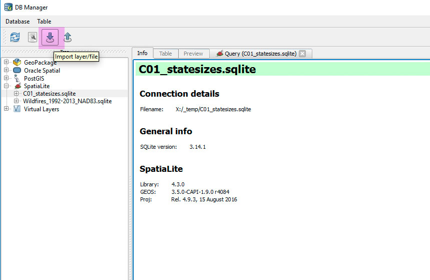
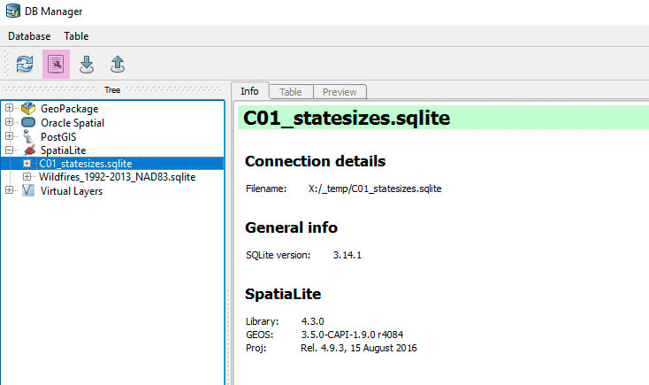

#HSLIDE
#GEO 409:01
##Advanced topics in GIS

#HSLIDE
##Topics
* Tools for the knowledge worker
* Challenge: calculate areas of Texas and Alaska

#HSLIDE
##Your task:
#Lesson 01
on Canvas


#HSLIDE
###Tools for the
##Knowledge Worker

#HSLIDE
##We need to
#manage text

#HSLIDE
###Particularly code, a/k/a
##plain text instructions.

#HSLIDE
##What are some code
#languages?

#HSLIDE
Structured Query Language
##SQL
pronounced "sequel", also just "SQL", & perhaps most used language to manage data.

#HSLIDE
##GIS is
#Big Data

#HSLIDE
Hypertext Markup Language
##HTML
The code that tells your browser how to display a web page.

#HSLIDE
(Carto) Cascading Style Sheets 
##CSS and CartoCSS
Used with HTML to render pretty web pages.

#HSLIDE
Start tinkering with examples
##<a href="http://www.w3schools.com" target="_blank">w3schools.com</a>

#HSLIDE
##What is in our
#Future?

#HSLIDE
We'll use a framework to start a web page
##<a href="http://getskeleton.com/" target="_blank">Get Skeleton</a>

#HSLIDE
Command-line processing using GDAL/OGR
###OSGeo4W shell or Mac OS terminal
E.g., command -input -output -parameters

#HSLIDE
Develop scripts to automate GIS workflow with
##<a href="http://interactivepython.org/courselib/static/thinkcspy/index.html" target="_blank">Python</a>
Most-used programming language in GIS.

#HSLIDE
##We need tools to
#manage text.

#HSLIDE
A good code editor offers
##Language syntax highlighting
auto-complete, find and replace, and code folding.

#HSLIDE
We'll use 
##Brackets
but install others like <a href="https://atom.io/" target="_blank">Atom</a> and <a href="https://www.sublimetext.com" target="_blank">Sublime</a>.


#HSLIDE?image=images/02/markdown.md.jpg
<h2 style="color:#eee;text-shadow: 2px 2px 4px #000;">Many ways to create</h2>
<a href="https://github.com/adam-p/markdown-here/wiki/Markdown-Cheatsheet" target="_blank">Markdown.md</a>

#HSLIDE
Manage projects to
##Prevent loss of text
and support collaboration

#HSLIDE
   
[xctd](http://xkcd.com/)


#HSLIDE  
[Git](https://git-scm.com/) was created by Linus Torvalds in 2005 for development of the Linux kernel, with other kernel developers contributing to its initial development.


#HSLIDE
We'll use the git hosting service [GitHub.com](https://github.com/) and their GitHub desktop app to manage our projects.

#HSLIDE
###Our GitHub flow
* Clone remote repository   
  (or create new local repo)
* Edit files and save
* Commit and sync

#HSLIDE
###GitHub Pages 
Use GitHub to publish web pages, including 
###Map Portfolio!

#HSLIDE
###GitHub.io
* Create repo named    
    ```<github-username>.github.io```    
    must be a public repo
* Create a ```docs``` folder inside private repo

#HSLIDE?image=images/02/github-settings.jpg


#HSLIDE
###Let's setup your local root 
##GIS project directory
where all of your GIS projects, assets, files, repos, and everything else will be stored related to class.

#HSLIDE
##Go to:
##```T:/users```
and create a folder called,   
```BoydsGIS```    
and make it unique!

#HSLIDE
##Let's create our first
#Repo and web page
via the lesson...

#HSLIDE
##Create a folder called
##```C01```
inside your GEO409 repo for our first challenge

#HSLIDE?image=images/02/natural-earth-download.jpg
<h2 style="color:#eee;text-shadow: 2px 2px 4px #000;">Download data</h2>
<a href="http://www.naturalearthdata.com/downloads/10m-cultural-vectors/" target="_blank">Natural Earth</a>


#HSLIDE
##Place data inside your ```C01``` folder
* Extract the zip
* Open ArcMap
* and QGIS


#HSLIDE
##Measure state areas in
#ArcMap

#HSLIDE
##Change your Data Frame's
#Projection

#HSLIDE?image=images/02/arcmap-projection.jpg
<h2 style="color:#111;text-shadow: 2px 2px 4px #eee;">EPSG: 5070</h2>

#HSLIDE
```
NAD_1983_Contiguous_USA_Albers
WKID: 5070 Authority: EPSG

Projection: Albers
False_Easting: 0.0
False_Northing: 0.0
Central_Meridian: -96.0
Standard_Parallel_1: 29.5
Standard_Parallel_2: 45.5
Latitude_Of_Origin: 23.0
Linear Unit: Meter (1.0)

Geographic Coordinate System: GCS_North_American_1983
Angular Unit: Degree (0.0174532925199433)
Prime Meridian: Greenwich (0.0)
Datum: D_North_American_1983
  Spheroid: GRS_1980
    Semimajor Axis: 6378137.0
    Semiminor Axis: 6356752.314140356
    Inverse Flattening: 298.257222101

```


#HSLIDE
```
North_America_Albers_Equal_Area_Conic
WKID: 102008 Authority: Esri

Projection: Albers
False_Easting: 0.0
False_Northing: 0.0
Central_Meridian: -96.0
Standard_Parallel_1: 20.0   // Only change in 
Standard_Parallel_2: 60.0   // standard parallels
Latitude_Of_Origin: 40.0    // and refocus north
Linear Unit: Meter (1.0)

Geographic Coordinate System: GCS_North_American_1983
Angular Unit: Degree (0.0174532925199433)
Prime Meridian: Greenwich (0.0)
Datum: D_North_American_1983
  Spheroid: GRS_1980
    Semimajor Axis: 6378137.0
    Semiminor Axis: 6356752.314140356
    Inverse Flattening: 298.257222101

```


#HSLIDE
###Select only those states we need
##Definition Query
```"name" in ('Texas','Alaska','Kentucky')```

#HSLIDE?image=images/02/arcmap-definition-query.jpg
<h2 style="color:#111;text-shadow: 2px 2px 4px #eee;"></h2>


#HSLIDE
##Open aatribute table
#Add Field
as **Type: Float**

#HSLIDE?image=images/02/arcmap-add-field.jpg
<h2 style="color:#111;text-shadow: 2px 2px 4px #eee;"></h2>

#HSLIDE
##Right+click
#Field
and **Calculate Geometry**

#HSLIDE?image=images/02/arcmap-area.jpg
<h2 style="color:#111;text-shadow: 2px 2px 4px #eee;"></h2>


#HSLIDE

##ArcMap mesaurement

```
name,       area_sq_km
Alaska,     1496210
Texas,      685531
Kentucky,   104525
```

#HSLIDE
##Measure state areas in
#QGIS


#HSLIDE
##Create new SpatiaLite database
    
Then open **QGIS menu > Database > DB Manager**


#HSLIDE
##Connect new database
    
Then **Import Layer**

#HSLIDE
##Import Layer
    
and select **Update options** and **Create spatial index**


#HSLIDE
##TFinally!
    
open SQL Window

#HSLIDE?image=images/02/qgis-execute-sql.jpg
<h2 style="color:#111;text-shadow: 2px 2px 4px #eee;">Execute SQL...</h2>


#HSLIDE

```sql
/* select everything */

select * from ne_10m_admin_1_states_provinces_lakes
```

#HSLIDE

```sql
/* select just texas, kentucky, and alaska */

select
    name
from 
    ne_10m_admin_1_states_provinces_lakes
where 
    name in ('Texas','Alaska','Kentucky')
```

#HSLIDE

```sql
/* select states and calculate area */

select
    name,
    ST_Area(geom) As "area in what units?"
from 
    ne_10m_admin_1_states_provinces_lakes
where 
    name in ('Texas','Alaska','Kentucky')
```

#HSLIDE

```sql
/* select states and calculate area in new projection, EPSG: 5070 */

select
    name,
    ST_Area(ST_Transform(geom, 5070)) As "sq. meters"
from 
    ne_10m_admin_1_states_provinces_lakes
where 
    name in ('Texas','Alaska','Kentucky')
```


#HSLIDE

```sql
/* select states and calculate area in new projection, EPSG: 5070 */

select
    name,
    ST_Area(ST_Transform(geom, 5070)/1000000) As "sq km"
from 
    ne_10m_admin_1_states_provinces_lakes
where 
    name in ('Texas','Alaska','Kentucky')
```

#HSLIDE

```sql
/* select states and calculate area in new projection, EPSG: 5070 */
/* and sort, too! */

select
    name,
    ST_Area(ST_Transform(geom, 5070))/1000000 As "sq km"
from 
    ne_10m_admin_1_states_provinces_lakes
where 
    name in ('Texas','Alaska','Kentucky')
order 
	by "sq km" DESC
    
```


#HSLIDE

##SpatiaLite measurement

```
name,       sq km
Alaska,     1505637.34
Texas,      684969.01
Kentucky,   104576.98

```


#HSLIDE

##FYI area on Spheroid via PostGIS

```
name,       sq km
Alaska,     1505638.85
Texas,      684969.02
Kentucky,   104576.98

```

#HSLIDE
##That's the
#Challenge
this semester and we'll keep at it!

