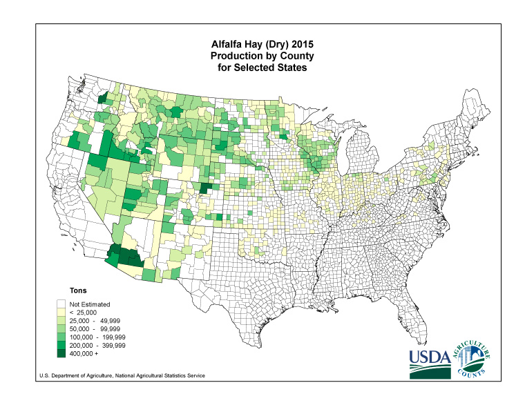
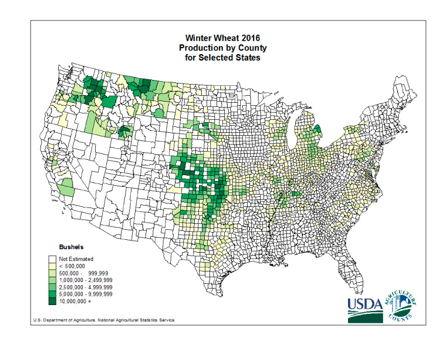

#HSLIDE
# GEO 409:04
## Week 06

#HSLIDE
## Attribute Joins
## & choropleth maps

#HSLIDE
## Topics
* Quantity mapping: choropleth maps
* Perform an attribute join in SQL
* Edit tables and add custom coordinate systems
* In class: world population density choropleth map
* Lab: Bluegrass County population density map

#HSLIDE
### Your task:
## Understanding density & ratio
How to measure the amount of x in y?

#HSLIDE

#HSLIDE

#HSLIDE
<h2 style="color:#eee;text-shadow: 2px 2px 4px #000;">More area = more production</h2>
<a href="https://www.nass.usda.gov/Charts_and_Maps/Crops_County/#oh" target="blank">USDA maps</a>

#HSLIDE
<h2 style="color:#eee;text-shadow: 2px 2px 4px #000;">Look right?</h2>

#HSLIDE
### Discuss!
Two buddies want to watch the game in a bar. One bar is 99% full. Another bar is 0% full. Between these two bars, what is the percentage full? Or restated, what is the chance that they can watch the game together?

#HSLIDE
### Hmm...
One of the bars has 100 seats and 99 are full and the other bar has 1 seat and 0 are full, so 98% full. ☹️

#HSLIDE
## Choropleth mapping
* Map quantity by enumeration units
	* e.g., County population maps
* Problem: larger areas can have larger quantities
* Solution: normalize by area of unit to make density measure

#HSLIDE?image=images/04/q12-map-54009.png
<h2 style="color:#eee;text-shadow: 2px 2px 4px #000;">raw count</h2>

#HSLIDE?image=images/04/q22-people-per-sq-km.png
<h2 style="color:#eee;text-shadow: 2px 2px 4px #000;">pop per sq km</h2>

#HSLIDE
## Use st_area() function
* Must transform data to equal-area projection
* Mollweide Projection, EPSG: 54009
* Find projection definitions with PostGIS `insert into` statements on <a href="http://epsg.io" target="blank">EPSG.io</a>

#HSLIDE
## Attribute Join
* Combine tables using shared field values
* Fields contain unique identifiers
	* Postal ID, geoid, your student ID...
* Used to map tables without geometry

#HSLIDE
## (inner) join
* Output table contains only matching records from both table
* An intersection of tables

#HSLIDE
## left (outer) join
* The left table (first table listed) keeps all records
* Only matching records from the right table are included

#HSLIDE
# Lab time!

#HSLIDE?image=https://c1.staticflickr.com/1/283/31923848984_7ee788c819_k.jpg
<h2 style="color:#eee;text-shadow: 2px 2px 4px #000;">Bluegrass population patterns</h2>
