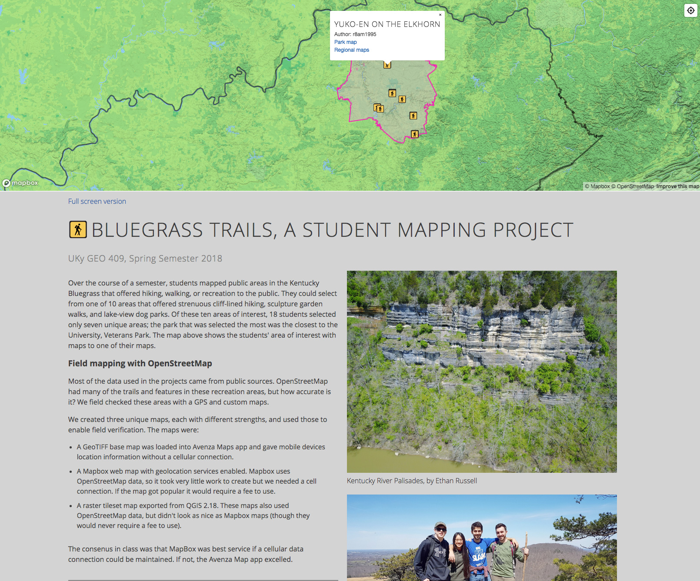
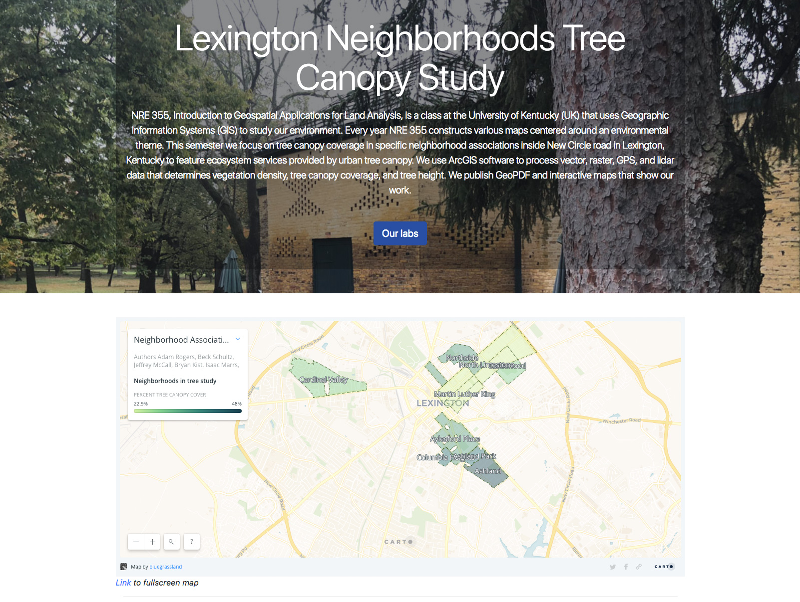
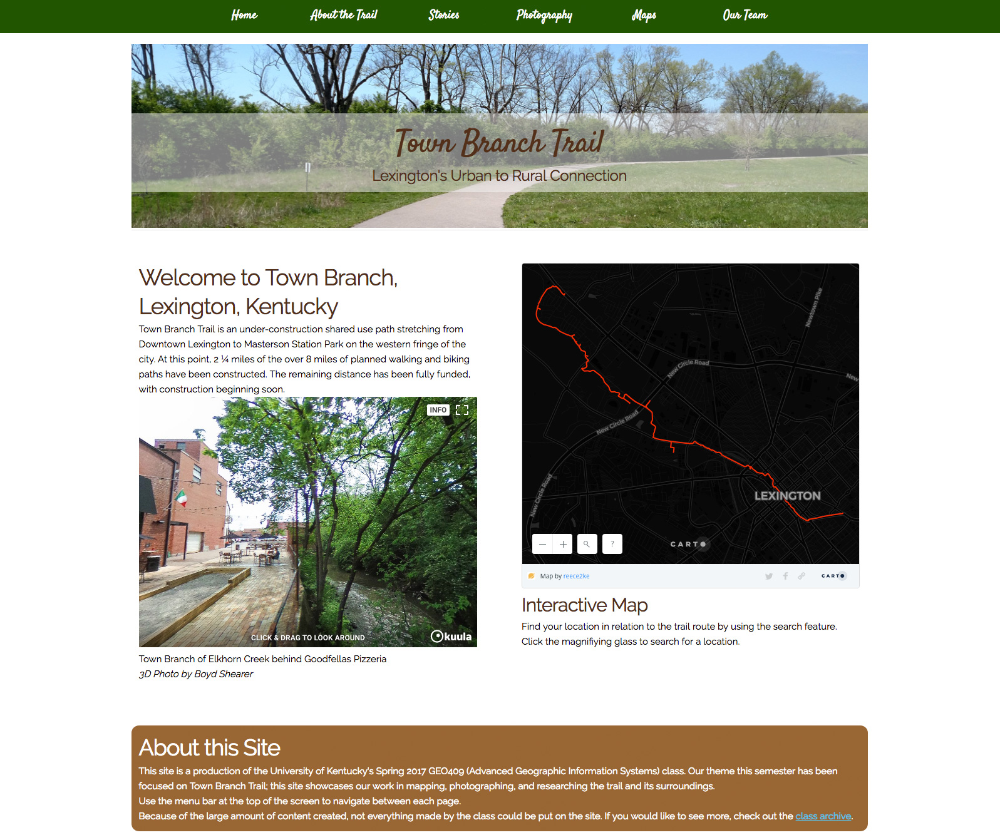
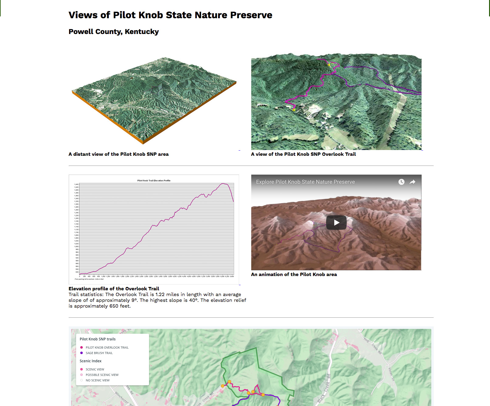
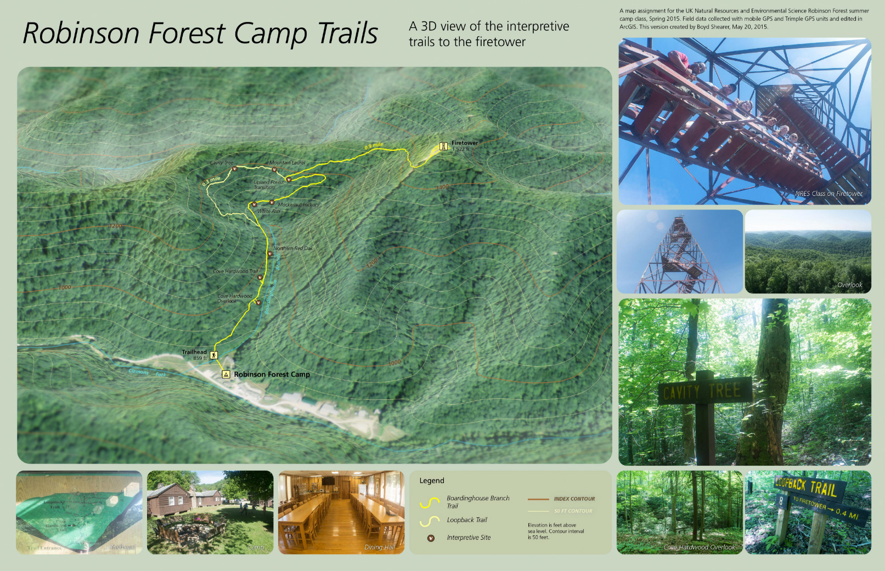

# Answers to Quinn's questionnaire for NRES story

1. How long did you teach NRE 355?
> I started teaching in NRES in the fall semester 2014 and taught four NRE355 classes.

2. What would you say is your official title/titles? (founder of OutraGIS Maps? Full time professor?
GIS specialist?)
> I'm currently faculty lecturer in the Department of Geography in the College of Arts and Sciences. I started outrageGIS mapping in 1999 as a way explore new map making techniques. It's kinda scary, but check out the [Wayback Machine's May 2000 iteration of outrageGIS.com](https://web.archive.org/web/20000531221159/http://www.outragegis.com:80/). A first success was selling a digital map package called "VideoGIS" for use on TV news. For awhile, I had a map on TV every day!

3. What was your favorite element of the NRE 355 course?
> When you see students "get it" it's a great feeling and I think any teacher would agree. Geographic Information System (GIS) software can have a pretty steep learning curve and it's a challenge. We had some brutal nights in front those computers! Eventually, many students felt like they controlled the technology and became creative map makers. One semester a student made a Christmas gift for their father and brother as their final project, a trail map of their local woods. Now, the greatest element(s) of the course were the students! You helped each other, collaborated well, and made the hours go by quickly.

4. What do you think was the students’ favorite element of the NRE 355 course?
> A class that's three-hours long, twice a week, and at night! Actually, that model helped students build camaraderie. I would say students liked the field work the most, because many students haven't been to places we visited. We did a tree canopy at Boone Creek Outdoors, camped at Cumberland Gap National Park, saw a sunset on Pilot Knob, and wandered around old neighborhoods of Lexington finding our ancient trees.

5. What are some of the areas/activities your students have mapped in the past?

>I'll list some recent projects with links to websites.

>  
Bluegrass Trails, a student mapping project [Link to site](https://tastyfreeze.github.io/bluegrass/region/)

>    
Lexington Neighborhood Tree Canopy Study [Link to site](https://rvirto01.github.io/NRE355_Tree_canopy_study/)

>   
Lexington's Town Branch Trail [Link to site](https://reece2ke.github.io/geo409_site/)

>   
Pilot Knob State Nature Preserve [Link to site](http://sweb.uky.edu/~blshea1/nre355/pksnp/)

>    
Robinson Forest (when you could go up the fire tower!) [Link to image](https://geography.as.uky.edu/sites/default/files/RobinsonForestCamp_TrailMap.jpg)

6. What do you hope students got out of this course?
> Students should feel like they can create new data, maps, visualizations, etc. that have worth and positively impact places. I like to remind students that maps show real places and real people and they should respect the areas they map.

7. Is there any specific aspect of this course that you would like me to include in this article?
> How about the GoPro videos of the tree canopy tour? [Website](http://sweb.uky.edu/~blshea1/nre355/pine-mountain-canopy-tour/)

8. What courses will you be teaching in the Spring? Which of those would be a good course for NRES students to take?
> I will be teaching GEO 409, T/TR 2-3:15, which is one of the required courses in our [GIS and Mapping Minor](https://uky-gis.github.io/). I help teach at New Maps Plus in the Department of Geography. This 100% online curriculum offers a Graduate Certificate in Mapping and a Masters of Science in Digital Mapping. So, if you're in school now and want to learn mapping, take the Minor. If you're graduating soon, consider the [New Maps Plus](https://newmapsplus.as.uky.edu/) opportunity!
 
9. If I have more questions, can I contact you again?
> Yep! You can reach a couple of ways [@boyd.shearer](https://geography.as.uky.edu/users/blshea1)

10. Photos from trips?

>Robinson Forest camp    
https://www.flickr.com/photos/28640579@N02/albums/72157680473658504

>Pine Mountain    
https://www.flickr.com/photos/28640579@N02/albums/72157661912235006

>Pilot Knob    
https://www.flickr.com/search/?user_id=28640579%40N02&sort=date-taken-desc&text=pilot%20knob&view_all=1

>Town Branch    
https://www.flickr.com/photos/28640579@N02/albums/72157683094775005

>Lexington Tree Canopy    
https://www.flickr.com/search/?user_id=28640579%40N02&sort=date-taken-desc&text=lexington%20canopy&view_all=1